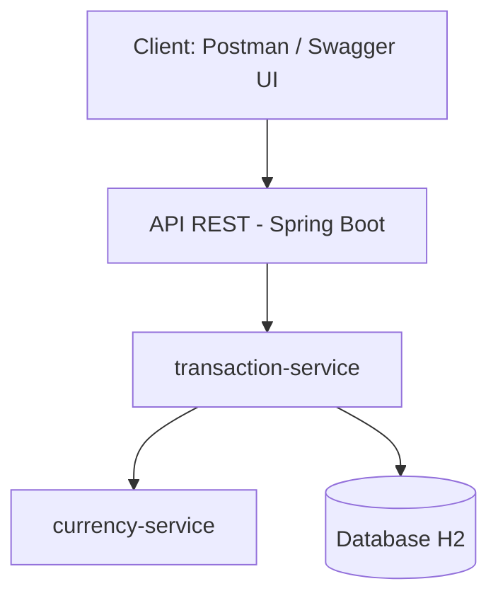

# API de transacciones de pago

## Descripción 

> Este proyecto es una API RESTful para la gestión segura y eficiente de transacciones de pago. Proporciona endpoints para crear transacciones, ver su estado y consultar el historial de transacciones aprobadas.

---

## Tabla de Contenidos

1. [Tecnologías y Herramientas](#tecnologías-y-herramientas)  
2. [Componentes Involucrados](#componentes-involucrados)  
3. [Instalación](#instalación)  
4. [Base de datos H2](#Base-de-datos-H2)
5. [Diagrama de Arquitectura](#diagrama-de-arquitectura)
6. [Ejemplos de Peticiones y Respuestas](#ejemplos-de-peticiones-y-respuestas)
7. [Documentación Swagger](#documentación-swagger)
8. [Pruebas y Cobertura](#pruebas-y-cobertura)
---

## Tecnologías y Herramientas

- **Lenguaje de programación:** Java 21
- **Frameworks:** Spring Boot 
- **Base de datos:** H2 en memoria
- **Herramienta de construcción:** Maven
- **Librerías adicionales:** 
- Lombok: utilizada para eliminar el código repetitivo, como getters, setters y constructores.
- SpringDoc - OpenAPI 3: utilizada para generar y exponer la documentación de la API en formato Swagger UI.

---

## Componentes Involucrados

- **transaction-service:** Se encarga de la lógica de negocio principal para la creación, consulta y gestión del ciclo de vida de las transacciones.
- **currency-service:** Gestiona el manejo de las monedas, incluyendo la validación y conversión, garantizando la consistencia de los datos en las transacciones.
- **Base de datos:** Base de datos en memoria H2 para almacenar temporalmente la información de las transacciones.

---

## Instalación

Clona el repositorio:  

```bash
git clone https://github.com/franndelgado/payment-transactions-api
```
```bash
cd payment-transactions-api
```

Luego abrir el proyecto en un Entorno de Desarrollo (IDE) como VS Code y ejecutarlo.

---

## Base de datos H2
Para visualizar la base de datos se debe:
1. Ingresar a http://localhost:8080/h2-console
2. Colocar "jdbc:h2:mem:paymentsdb" en la sección JDBC URL.
3. Colocar "user" en User name.
4. Hacer click en Connect.
---

## Diagrama de Arquitectura


--- 
### Ejemplos de Peticiones y Respuestas

A continuación, se describen los principales endpoints de la API, incluyendo el método HTTP, la URL, la descripción y un ejemplo de la petición y respuesta esperada.

#### - **URL**: `http://localhost:8080/api/transactions`

- **Descripción:** Recibe un Transaction Request con los valores de la transacción, valida que los datos estén presentes y correctos. Una vez validado, crea una nueva transacción asignándole un estado inicial y devuelve un Transaction Response con el código 201 CREATED.
- **Método:** `POST`
- **Request Body Example**:
```json
{ 
    "user_id": "113411", 
    "amount": "100.00", 
    "currency": "EUR",
    "bank_code": "BANK123", 
    "recipient_account": "DE343543543534543" 
}
```
- **Respuesta**:
```json
{
    "amount": 170600.00,
    "currency": "ARS",
    "status": "NOT_APPROVED",
    "transaction_id": "1cc8e9fe-0245-4fe3-8566-0ff0c2fc5e40",
    "user_id": "113411",
    "created_at": "2025-09-16T14:01:06.451457900Z",
    "bank_code": "BANK123",
    "recipient_account": "DE89370400440532013000"
}
```
---
#### - **URL**: `http://localhost:8080/api/transactions/{transactionId}/status`

- **Descripción:** Recibe un Transaction Id por path variable y retorna el estado de la transacción con el código 200 OK. Si no existe el transaction id arrojará error 404 Not Found.
- **Método:** `GET`
- **Respuestas posibles**:
```json
"APPROVED"
```
```json
"NOT_APPROVED"
```
- **Respuesta de Error cuando no se encuentra el transactionId**:
```json
{
    "error": "The transaction identifier '1cc8e9ee-0245-4fe3-8566-0ff0c2fc5e40' does not exist."
}
```
- **Respuesta de Error cuando transactionId es inválido**:
```json
{
    "transactionId": "Transaction ID must be a valid UUID"
}
```

#### - **URL**: `http://localhost:8080/api/transactions/approved?userId=113411`

- **Descripción:** Recibe un User Id por parámetro y retorna las transacciones aprobadas de dicho usuario.
- **Método:** `GET`
- **Respuesta**:
```json
{
    "content": [
        {
            "amount": 170600.00,
            "currency": "ARS",
            "status": "APPROVED",
            "transaction_id": "8cc40760-e58d-471f-8081-994de84d28fa",
            "user_id": "113411",
            "created_at": "2025-09-16T14:13:06.745957Z",
            "bank_code": "BANK123",
            "recipient_account": "DE89370400440532013000"
        }
    ],
    "pageable": {
        "pageNumber": 0,
        "pageSize": 10,
        "sort": {
            "empty": false,
            "sorted": true,
            "unsorted": false
        },
        "offset": 0,
        "paged": true,
        "unpaged": false
    },
    "totalElements": 1,
    "totalPages": 1,
    "last": true,
    "size": 10,
    "number": 0,
    "sort": {
        "empty": false,
        "sorted": true,
        "unsorted": false
    },
    "numberOfElements": 1,
    "first": true,
    "empty": false
}
```
> Nota: En la raíz del proyecto se encuentra la colección de Postman para poder importarla y 
ejecutar los distintos endpoints mencionados. 
---
## Documentación Swagger

- Una vez levantado el proyecto se puede visualizar su documentación Swagger en el link: http://localhost:8080/swagger-ui/index.html#
- También está disponible en formato JSON en: (http://localhost:8080/v3/api-docs)
---
## Pruebas y Cobertura
- Framework de pruebas: JUnit y Mockito
- Cobertura actual: **90%**